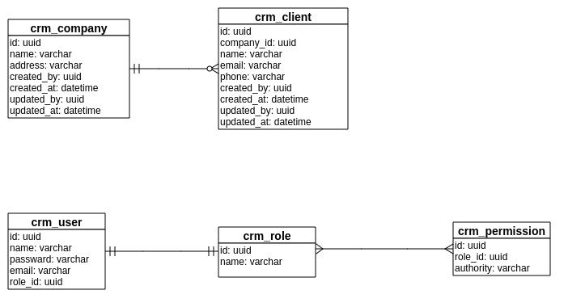

# Smartbee CRM Example
This is a simple CRM project to fit the specific requirements which will be mentioned below.

## Functional requirements:
   1. Authentication/authorization: 3 required roles and permissions
   
       | Role | privileges |
       |---|---|
       | super user| access to all functions. |
       | manager | modify / delete / view company / client data. |
       | operator | create / view company / client data. |
   
   2. Platform users must login first to access the system. Based on their roles,
   they can only access APIs which they are permitted to use.
   3. Basic CRUD APIs for Company and Client data. Please refer to the table
   schema above.
   4. An additional API to add multiple clients in one single request.

## ERD


## Getting Started
These instructions will get you a copy of the project up and running on your local machine.

### Prerequisites
- Java 8+
- Maven
- Docker

## Usage
### Installing
Package the app and build the docker image.
```shell
mvn clean install docker:build
```

Run a docker container.
```shell
docker run -d -p 8010:8010 --name smartbee-simple-crm smartbee/simple-crm-example
```
With above command the docker container would expose the port to 8010 on your local machine and the service context
 would be [http://localhost:8010](http://localhost:8010). 

### Authentication
The JWT authentication implements with the Spring Security framework. So, login and set a token on
 HTTP header would be mandatory before invokes any API endpoint. The login user info as follows:

| Username | Password |
|---|---|
| admin | admin |
| manager | manager |
| operator | operator |

### API Document
The Swagger has been included in this project. Please see [here](http://localhost:8010/swagger-ui.html) once the
 app has been startup.

## License
[](http://badges.mit-license.org)


 